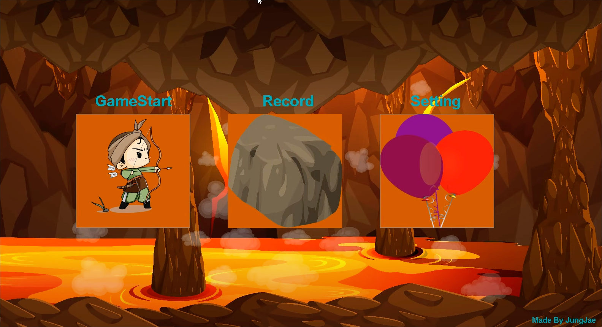
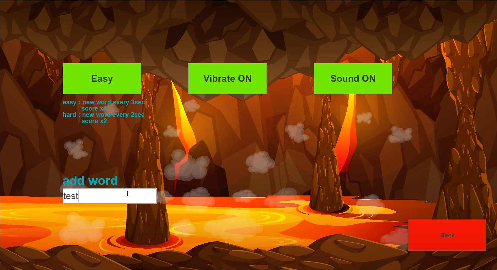

# 동굴에서 살아남기: 멀티 스레드 생존 게임

### [소개 영상](https://www.youtube.com/watch?v=3-gc0p6cxSM&t=85s)
## 프로젝트 개요
"동굴에서 살아남기"는 자바로 구현된 멀티 스레드 기반의 게임입니다. 이 게임은 2020년 2학기 객체지향 프로그래밍 수업의 기말 고사 프로젝트로 시작되었습니다. 플레이어는 주인공 '자바'를 조종하여 실시간으로 떨어지는 돌과 풍선을 피해 동굴에서 살아남아야 합니다.

## 핵심 특징
- **멀티 스레드를 통한 실시간 게임 플레이**: 게임은 동시에 여러 이벤트가 발생하는 멀티 스레드 환경에서 실행됩니다.
- **객체지향적 설계**: 코드의 재사용성과 확장성을 높이기 위해 객체지향 설계 원칙을 따랐습니다.
- **다양한 게임 모드**: Easy와 Hard 두 가지 난이도로 플레이어의 게임 경험을 다양화합니다.
- **사운드 및 시각 효과**: 다채로운 사운드 효과와 시각 효과로 게임의 몰입감을 높였습니다.
- **사용자 설정 지원**: 게임 소리, 난이도, 진동 여부 및 단어 추가와 같은 다양한 사용자 설정을 지원합니다.
  

## 시작 방법
1. 이 프로젝트를 귀하의 로컬 시스템에 클론합니다.
2. 자바 개발 키트(JDK)가 설치되어 있는지 확인합니다.
3. 커맨드 라인에서 다음을 실행하여 게임을 시작합니다:
```shell
./gradlew runJar
```

## 게임 플레이
게임을 시작하면 주인공 '자바'가 동굴에 갇히게 됩니다. 플레이어는 떨어지는 돌을 피하고, 풍선을 터트려 바닥이 무너지는 것을 방지해야 합니다. 특별한 "!HEAL!" 돌을 잡아 바닥의 체력을 회복할 수도 있습니다.